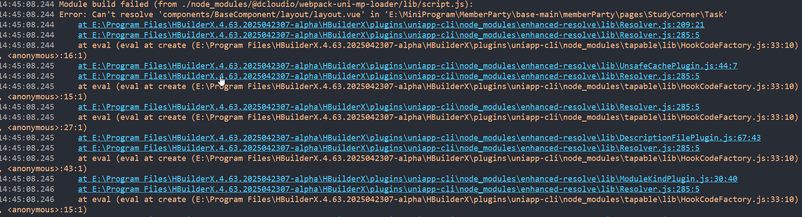

# WeChatMiniParams(微信小程序)

命名规则：下划线后的字母必须小写
Naming Rule: When using underscores in names, the letter following the underscore must be lowercase.

微信小程序的 Base64 转换方法与标准 Web 不同
Base64 Conversion: Base64 conversion in WeChat Mini Programs is different from standard web methods.

Click 事件不能传参时使用 :data-*
Passing Parameters in Click: If you can’t pass parameters directly in a click event, use :data-*="parameter" instead.

Image 标签 width 或 height 为 auto 会直接不显示
Image Display: If width or height of an image is auto, the image won’t show at all. You must provide a concrete value (even 100% may not work).

微信小程序中 left 等属性 rpx 实际调试参数是 px
Positioning Units: In WeChat Mini Programs, properties like left may be written in rpx, but during debugging the actual value is in px.

动态绑定 class 时必须使用数组
Dynamic Class Binding: When dynamically binding classes, you must use an array, otherwise class names can randomly disappear for no apparent reason.

父组件传函数到子组件偶现失效
Passing Functions: Passing a function from parent to child via :xxx= sometimes fails and the child receives its own this. Solution: Use @ to pass the function.

避免在标签上直接使用 v-if
v-if Usage: Never put v-if directly on elements in WeChat Mini Programs, it can cause big, frustrating problems.

涉及页面更新的变量必须使用 $set
Updating Variables: Any variable related to page updates (especially in uniapp) must be updated using $set.

类切换顺序要注意
Class Switching: When switching classes, ensure the switching class is after the base class; otherwise, the new class may refuse to work for reasons only WeChat knows.

微信小程序的变量不能有多个不同的逻辑复用会导致页面无法正常渲染（哪怕是临时变量也不行
WeChat Mini Program variables cannot be reused with multiple different logics, which will cause the page to not render properly (even temporary variables are not allowed)

注意微信小程序的模拟器上部分状态下disply:flex和正常web的不会一致（具体场景正在进行验证）
Note that in some states of the WeChat applet simulator, the display:flex will not be consistent with the normal web (specific scenarios are being verified)

微信小程序的模拟器上的canvas是不会随着页面的滚动而滚动的（实机测试没有这个问题）
The canvas on the WeChat applet simulator does not scroll as the page scrolls (there is no such problem in the actual machine test)

注意uniapp转微信小程序最好不要使用click方法使用tap（否则会导致向父组件传参出现异常）
Note that it is best not to use the click method when transferring uniapp to WeChat applet, but tap (otherwise it will cause an exception when passing parameters to the parent component)

注意uniapp转微信小程序如果父组件要向子组件传参注意props必须放在export default的最前部分，vue3版本必须放在除导入的内容之外的最前部分 否则会导致参数无法正常传递
Note that when transferring from uniapp to WeChat applet, if the parent component needs to pass parameters to the child component, please note that props must be placed at the beginning of the export default. The vue3 version must be placed at the beginning except for the imported content, otherwise the parameters will not be passed normally.

注意uniapp转微信小程序偶尔会出现css样式完全失效的情况 解决方案:关闭微信小程序开发工具（包含后台进程），在uniapp的开发工具中将预览终止，将已经编译的unpackage文件夹删除，然后重新编译（触发原因未知）。
Note that converting uniapp to WeChat Mini Program may occasionally result in complete CSS style failure. Solution: Close WeChat Mini Program development tools (including background processes), terminate the preview in the uniapp development tools, delete the already compiled unpackage folder, and then recompile(The reason for the trigger is unknown).

注意微信小程序开发者工具如果运行不起来且后台进程无法关闭 建议直接卸载然后重装
Note: If the WeChat Mini Program Developer Tool does not work and the background process cannot be closed, it is recommended to uninstall and reinstall it.

注意uniapp和微信小程序均不支持以中文作为类名和变量名
Please note that neither Uniapp nor WeChat Mini Programs support using Chinese as class names or variable names.

uniapp转微信小程序报错如下(The error when converting uniapp to WeChat mini program is as follows)：

解决方案：检查路径引入（大部分是路径引入出现问题）
Solution: Check the path import (most of the time the issue is with the path import)

